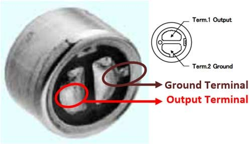

# VoiceRemoteTx

## Hardware Configuration

### Interfacing nRF24L01 with MCU

Pinout of nRF24L01 is following:


The power consumption of this module is just around 12mA during transmission, which is even lower than a single LED. The operating voltage of the module is from 1.9 to 3.6V, but the other pins tolerate 5V logic. SCK, MOSI and MISO - these pins are for the SPI communication and they need to be connected to the SPI pins of the Arduino, but note that each Arduino board have different SPI pins. The pins CSN and CE can be connected to any digital pin of the Arduino board and they are used for setting the module in standby or active mode, as well as for switching between transmit or command mode. The last pin is an interrupt pin which doesn’t have to be used.

For the Tx module of this project, pins of nRF24L01 module will be connected to Arduino according to the following table:

| nRF24L01 | Arduino Nano/Uno | Arduino Mega |
|--|--|--|
| V<sub>cc</sub> (3.3V) | 3.3V | 3.3V |
| GND | GND | GND |
| CSN<sup>[1](#footnote1)</sup> | 8 | 8 |
| CE<sup>[1](#footnote1)</sup> | 7 | 7 |
| SCK | 13 | 52 |
| MOSI | 11 | 51 |
| MISO | 12 | 50 |
| IRQ | Not Connected | Not Connected |

### Interfacing the Keypad with MCU

This keypad has 12 buttons, arranged in a 3×4 grid. The keys are connected into a matrix, so we need 7 microcontroller pins (3-columns and 4-rows) to connect the key pad. The pinout of the keypad module is shown below:


Keypad pins will be connected with the following arduino pins:

| Keypad Pin | Arduino Pin |
|--|--|
| R1 | D9 |
| R2 | A1 <sup>[2](#footnote2)</sup> |
| R3 | D5 |
| R4 | D6 |
| C1 | D2 |
| C2 | D3 |
| C3 | D4 |

### Interfacing Microphone with MCU

Electret microphones are used in this project for voice input. Electret microphone can be very sensitive, very durable, extremely compact in size and has low power requirements. Electret microphones are used in very many applications where small and inexpensive microphones with good performance characteristics are needed. But the signal created by the mic itself is very low and hence needs amplification. In this project, the microphone signal was amplified in two stages.

#### Microphone

The electret is a modified version of the classic capacitor (or condenser) microphone, which exploits changes in capacitance due to mechanical vibrations to produce voltage variations proportional to sound waves. Typical electret condenser microphone capsule is a 2 terminal device (there are also 3 pin capsules) which approximates to a current source when biassed with around 1-9 volt and routinely consumes less than half a milliamp.

||
| :-: |
| *Pinout of Electret Microphone* |

#### LM358 Microphone Preamplifier (Amplifier Stage I)

LM358 is a high gain, internally frequency compensated, operational amplifier specifically designed to operate from a single power source over a wide range of voltages.

||
| :-: |
| *Pinout of LM-358* |

Complete circuit diagram of the preamp is following:


The **V_OUT** terminal can used to drive in-ear headphones if necessary to test. **V_OUT_UC** terminal output will be passed to [stage II](#LM386-Audio-Amplifier-Amplifier-Stage-II) for further amplification.

#### LM386 Audio Amplifier (Amplifier Stage II)


LM386 Audio Amplifier Module has 4 input pins and an output wiring block with GND and OUT.

Input pins connections are shown below.

| Stage II input Pin | Stage I Terminal | Arduino Pin |
|--|--|--|
|Vcc|X|5V|
|IN|Stage I V_OUT_UC|X|
|GND (audio) |X|GND|
|GND|X|GND|

The stage II out would be connected to A0 pin of the Arduino.

| Stage II Output Pin | Arduino Pin |
|--|--|
| Output | AO |
| GND | GND |

High level block diagram of the transmitter system may further clarify the mechanism.


### Sample Hardware

A labeled Figure of the hardware implementation.


## Loading Sketch

> This project is developed and tested in [Debian Buster](https://www.debian.org/releases/buster/) machine. For all standard Debian and Ubuntu based systems following instructions are expected to work.


### Install VS Code

Use [Snap](https://snapcraft.io/code) to install VS Code if not installed already.
```bash
$ sudo snap install code --classic
```

If your system does not have snap installed already, install it.

```bash
$ sudo apt update
$ sudo apt install snapd
```

### Install PlatformIO

PlatformIO was used for smoother development and debugging features. It has all the necessary tool-chains for embedded system development. Install the [PlatformIO extension](https://marketplace.visualstudio.com/items?itemName=platformio.platformio-ide) for VS Code.

Launch VS Code Quick Open ( <kbd>Ctrl</kbd> + <kbd>P</kbd> ), paste the following command, and press enter.

```bash
ext install platformio.platformio-ide
```
>Arduino IDE is also one of its dependency. install it from [SnapCraft](https://snapcraft.io/code) with the following command:
>
>```bash
>$ sudo snap install arduino
>```
>
>If facing any problem to upload code to device, these commands may faix it.
>
>```bash
>$ sudo usermod -a -G dialout $USER
>$ arduino.pip install requests
>```

### Configuring PlatformIO  

Plug in the Arduino USB cable in a USB port and issue following command:

```bash
$ dmesg | grep tty
```

The last line of the output should contain the name of the serial port the arduino is connected to. It should be something like `ttyACM0`  or `ttyUSB0`.

Now navigate to __platformio.ini__ file located in the project root directory and set the `upload_port` and `monitor_port` to the serial port name the Arduino is connected to.

Example:

```ini
[env:nanoatmega328]
platform = atmelavr
board = nanoatmega328
framework = arduino
upload_port = /dev/ttyUSB0
monitor_port = /dev/ttyUSB0
monitor_speed = 115200
```

Follow the [official documentation](https://docs.platformio.org/en/latest/integration/ide/vscode.html) of platformIO if necessary.

### Upload Sketch

Upon connecting the board and configuring it correctly, Open VS Code command pallette with pressing <kbd>Ctrl</kbd> + <kbd>Shift</kbd> + <kbd>P</kbd>.

Use the `PlatformIO: Upload` command to upload the code to the board.

## Data Format

The buffer size for data transfer is 32 byte. Upon every button press a 32 byte packet will be transmitted. Audio transmission will be achieved using multiple 32 byte packets. A header packet will indicate the commencement of an audio transmission and a stop packet will symbolize the end.

### Button Signal Format

The 32 byte button signal packet will be of following structure:

| Character index | 0 | 1-6 | 7-22 | 23-29 | 30 | 31 |
|--|--|--|--|--|--|--|
| Character | ␂ | &lt;inpt>| 0 or 1 | &lt;/inpt>| ␄ | Not used yet |

> Assuming a 0 based index system.

According to the use case of this remote, only one button press can be registered at a time. So, any one of the characters from index 7 to 22 would be 1 and the rest would be 0. The character set to 1 would symbolize the button being pressed.

| Character at index set to 1 | Corresponding button |
|--|--|
| 7 | <kbd>0</kbd> |
| 8 | <kbd>1</kbd> |
| 9 | <kbd>2</kbd> |
| 10 | <kbd>3</kbd> |
| 11 | <kbd>4</kbd> |
| 12 | <kbd>5</kbd> |
| 13 | <kbd>6</kbd> |
| 14 | <kbd>7</kbd> |
| 15 | <kbd>8</kbd> |
| 16 | <kbd>9</kbd> |
| 18 | <kbd>#</kbd> |

Characters at index 17 and 19-22 are not used currently and could be used in later versions for more buttons, if necessary.  

>Example:
>
>`␂<inpt>1000000000000000</inpt>␄` would mean button <kbd>0</kbd> is pressed.
>
>`␂<inpt>1000000000010000</inpt>␄` would mean button <kbd>#</kbd> is pressed.

### Audio Signal Format

>The <kbd>*</kbd> button on the keypad would work as **PTT (Push to Talk)** and establish audio transmission during the time it is held.

Audio transmissions are conducted using three kind of packets. All of them has 32 bits.

1. Audio Header Packet
2. Audio Packet
3. Audio Footer Packet

#### Audio Header Packet

This packet structure is following:

| Character index | 0 | 1-30 | 31 |
|--|--|--|--|
| Character | ␂ | . | Not used yet |

>Example: `␂..............................`

#### Audio Packet

These are analog audio data. So, these packets are expected to nothing more than gibberish containing various printable or/and non-printable ASCII characters. These packets would need further processing from the receiver end.

#### Audio Footer Packet

This packet structure is following:

| Character index | 0-29 | 30 | 31 |
|--|--|--|--|
| Character | . | ␄ | Not used yet |

>Example: `..............................␄` 

## References

1. How nRF24L01+ Wireless Module Works & Interface with Arduino, [Last Minute Engineering](https://lastminuteengineers.com/nrf24l01-arduino-wireless-communication/)
2. Tomi Engdahl, Powering Microphones, [ePanorama.net](https://www.epanorama.net/circuits/microphone_powering.html)
3. Dimitar Kovachev, LM358 microphone amplifier, [Low voltage. Mostly harmless…](https://lowvoltage.wordpress.com/2011/05/21/lm358-mic-amp/)
4. Texas Instruments, LMx58-N Low-Power, Dual-Operational Amplifiers [Datasheet](https://www.ti.com/lit/ds/symlink/lm358-n.pdf?ts=1594025525189&ref_url=https%253A%252F%252Fwww.google.com%252F)
5. Texas Instruments, LM386 Low Voltage Audio Power Amplifier
[Datasheet](https://www.ti.com/lit/ds/symlink/lm386.pdf)
6. TMRh20 2020, RF24 - Optimized high speed nRF24L01+ driver [Documentation](http://tmrh20.github.io/RF24/)
7. TMRh20 2020, RF24Audio - Realtime Audio Streaming Library for Arduino [Documentation](http://tmrh20.github.io/RF24Audio/)
___

##### Footnotes

<a name="footnote1">[1]</a> Declared in code</br>
<a name="footnote2">[2]</a> Originally D10 was used. But that pin was damaged later.</br>
[3] ␂ is ASCII Character (02)<sub>10</sub></br>
[4] ␄ is ASCII Character (04)<sub>10</sub>
